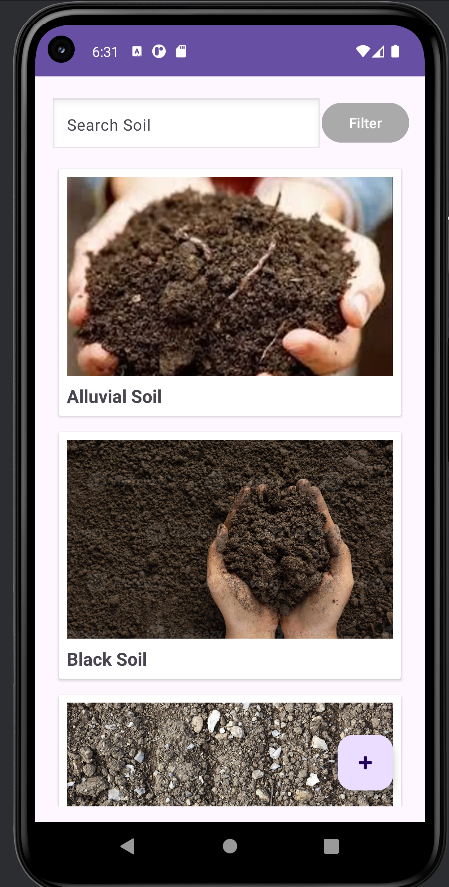
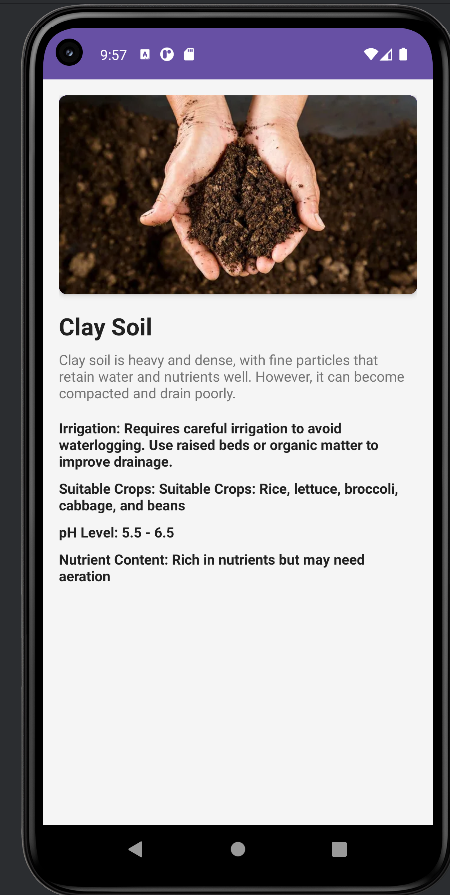

# 🌱 Soil Guide App - Smart Agriculture Companion

[](https://www.android.com)
[](https://www.java.com)
[](LICENSE)
[](https://github.com/CarbezonKARDE/soil-guide-app)

**Soil Guide** is an intelligent Android application designed to empower farmers, gardeners, and agricultural professionals with comprehensive soil analysis and crop optimization tools.

<p align="center">
  
  
</p>

---

## ✨ Key Features

- **Comprehensive Soil Database**  
  Detailed profiles for 12+ soil types including:
  - Sandy • Clay • Loamy • Peaty 
  - Chalky • Volcanic • Laterite
  - And more...

- **Smart Search & Filter**  
  Instant search functionality with auto-suggestions

- **Detailed Soil Analysis**  
  Each profile includes:
  - 📊 pH level & nutrient content
  - 💧 Irrigation requirements
  - 🌱 Ideal crops with planting tips
  - � Soil structure characteristics

- **Modern UI Components**  
  - Beautiful CardView layouts
  - Smooth RecyclerView performance
  - Intuitive navigation transitions
  - Dark/Light theme support

- **Offline Capable**  
  All data available without internet connection

---

## 🚀 Getting Started

### Prerequisites
- Android Studio Flamingo (2022.2.1) or later
- Android SDK 33 (Tiramisu)
- Java JDK 11

### Installation
1. **Clone the repository**:
   ```bash
   git clone https://github.com/CarbezonKARDE/soil-guide-app.git
   cd soil-guide-app
