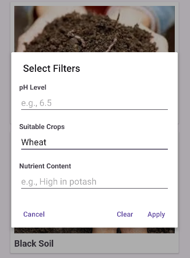

# 🌱 Soil Guide App

[](https://www.android.com)
[](https://www.java.com)
[](LICENSE)

**Soil Guide** is an Android app that helps farmers, gardeners, and agricultural enthusiasts identify soil types and optimize crop selection. Discover soil properties, irrigation needs, pH levels, and suitable crops in one place!

<p align="center">
  
  
</p>

---

## ✨ Features
- Browse 12+ soil types (sandy, clay, loamy, volcanic, etc.).
- Search soils by name.
- Detailed view with:
  - Soil description
  - Irrigation requirements
  - Suitable crops
  - pH level & nutrient content
- Modern UI with **CardView** and **RecyclerView**.
- Smooth animations and transitions.

---

## 🛠️ Installation
1. **Clone the repository**:
   ```bash
   git clone https://github.com/yourusername/soil-guide-app.git
   ```
2. **Open the project in Android Studio.**

3. **Build the project (Build > Make Project).**

4. **Run the app on an emulator or physical device (Run > Run 'app').**

---

## 📱 Usage
1. **Open the app to see a grid of soil types.**

2. **Search for a specific soil using the search bar.**

3. **Click any soil card to view detailed information.**

4. **Use the back button to return to the list.**

---

## 📊 UML Diagrams

1. **Class Diagram:**
  ```mermaid
classDiagram
    class Soil {
        -String name
        -int imageResource
        -String description
        -String irrigation
        -String suitableCrops
        -String phLevel
        -String nutrientContent
        +getName() String
        +getImageResource() int
        +getDescription() String
        +getIrrigation() String
        +getSuitableCrops() String
        +getPhLevel() String
        +getNutrientContent() String
    }

    class MainActivity {
        -SoilAdapter adapter
        -List~Soil~ soilList
        +onCreate(Bundle savedInstanceState) void
        +onSoilClick(int position) void
    }

    class DetailActivity {
        +onCreate(Bundle savedInstanceState) void
    }

    class SoilAdapter {
        -List~Soil~ soilList
        -List~Soil~ soilListFull
        -OnSoilClickListener listener
        +SoilAdapter(List~Soil~ soilList, OnSoilClickListener listener)
        +onCreateViewHolder(ViewGroup parent, int viewType) SoilViewHolder
        +onBindViewHolder(SoilViewHolder holder, int position) void
        +getFilter() Filter
    }


    MainActivity --> SoilAdapter : uses
    SoilAdapter --> Soil : displays data
    MainActivity --> DetailActivity : launches
    DetailActivity --> Soil : displays details
  ```

2. **Activity Diagram:**


3. **UI Sequence Diagram**


---
## 🤝 Contributing
**Contributions are welcome! Follow these steps:**
- Fork the repository.
- Create a branch (git checkout -b feature/your-feature).
- Commit changes (git commit -m 'Add feature').
- Push to the branch (git push origin feature/your-feature).
- Open a Pull Request.
---

# 📧 Contact
**GitHub: CarbezonKARDE**

**Email: taskforkarde@gmail.com**

---
📜 License
This project is licensed under the MIT License. See [LICENSE](LICENSE.txt) for details.

---
